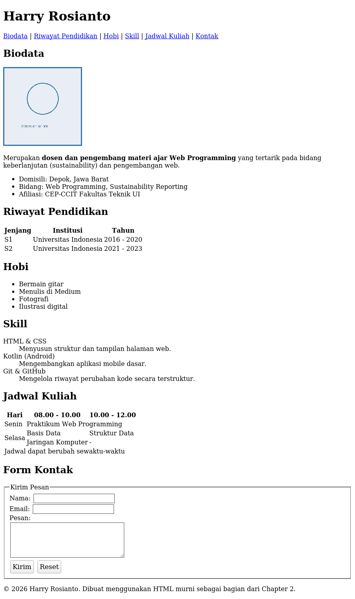

# Chapter 2 — HTML Fundamentals

## Deskripsi

Chapter ini melanjutkan Chapter 1 dengan masuk lebih dalam ke HTML sebagai fondasi struktur setiap halaman web. Fokus chapter ini adalah menyusun struktur dokumen HTML yang benar, mulai dari heading, paragraph, formatting text, hyperlink, image, list, table, form, hingga Semantic HTML — seluruhnya tanpa CSS maupun JavaScript.

## Learning Objectives

Setelah menyelesaikan chapter ini, mahasiswa mampu:

- Menyusun struktur dasar dokumen HTML yang valid sesuai standar HTML5.
- Menggunakan heading, paragraph, dan formatting text secara tepat dan bermakna.
- Membuat hyperlink ke halaman lain, email, nomor telepon, dan anchor pada halaman yang sama.
- Menyisipkan gambar dengan atribut yang mendukung accessibility.
- Menyusun list, tabel data, dan form input dengan struktur yang benar.
- Menerapkan Semantic HTML untuk meningkatkan struktur, accessibility, dan SEO halaman.
- Melakukan validasi dokumen HTML menggunakan W3C Validator.

## Cara Menjalankan Project

1. Masuk ke folder chapter ini:
   ```bash
   cd chapter-2
   ```
2. Untuk melihat hasil akhir referensi, buka `mini-project/final/index.html` di Visual Studio Code.
3. Untuk berlatih dari awal, buka `mini-project/starter/index.html` (berisi TODO) atau folder `praktikum/` untuk latihan bertahap.
4. Klik kanan pada file `.html` yang dipilih → **Open with Live Server**.
5. Halaman akan terbuka otomatis di browser pada `http://127.0.0.1:5500/`.

## Struktur Folder

```
chapter-2/
├── README.md
├── praktikum/
│   ├── praktikum-1-hello-html/
│   │   ├── INSTRUKSI.md
│   │   └── starter/index.html
│   ├── praktikum-2-biodata/
│   │   ├── INSTRUKSI.md
│   │   └── starter/index.html
│   ├── praktikum-3-profil-mahasiswa/
│   │   ├── INSTRUKSI.md
│   │   └── starter/
│   │       ├── index.html
│   │       └── assets/foto-placeholder.jpg
│   └── praktikum-4-halaman-berita/
│       ├── INSTRUKSI.md
│       └── starter/index.html
├── challenge/
│   ├── INSTRUKSI.md
│   └── starter/galeri.html
├── mini-project/
│   ├── REQUIREMENTS.md
│   ├── starter/
│   │   ├── index.html          # Starter Code — berisi TODO
│   │   └── assets/foto-placeholder.jpg
│   └── final/
│       ├── index.html          # Final Code — sudah lengkap
│       └── assets/foto-placeholder.jpg
└── assets/
    └── screenshot-hasil-akhir.png
```

## Penjelasan Setiap File

| File / Folder | Penjelasan |
|---|---|
| `praktikum/praktikum-1-hello-html/starter/index.html` | Latihan pertama: struktur dasar HTML dan halaman "Hello HTML". |
| `praktikum/praktikum-2-biodata/starter/index.html` | Latihan kedua: heading, paragraph, formatting text, dan list pada biodata sederhana. |
| `praktikum/praktikum-3-profil-mahasiswa/starter/index.html` | Latihan ketiga: image, hyperlink, dan table pada halaman profil mahasiswa. |
| `praktikum/praktikum-4-halaman-berita/starter/index.html` | Latihan keempat: penerapan Semantic HTML secara menyeluruh pada halaman berita. |
| `challenge/starter/galeri.html` | Starter skeleton untuk challenge mandiri (galeri gambar + form + navigasi). Solusi tidak disediakan. |
| `mini-project/starter/index.html` | Starter Code — kerangka Website Profil Pribadi dengan TODO pada setiap bagian. |
| `mini-project/final/index.html` | Final Code — Website Profil Pribadi lengkap sesuai seluruh requirements chapter ini. |
| `assets/screenshot-hasil-akhir.png` | Screenshot asli hasil render `mini-project/final/index.html`, diambil otomatis menggunakan browser headless. |

## Screenshot



> Screenshot di atas adalah hasil render asli dari `mini-project/final/index.html`. Karena chapter ini belum menggunakan CSS, tampilannya memang masih polos mengikuti gaya default browser — hal ini sudah sesuai dengan cakupan materi chapter ini.

## Assignment

- [ ] **Praktikum 1–4** — Selesaikan seluruh starter code pada folder `praktikum/` sesuai `INSTRUKSI.md` masing-masing.
- [ ] **Challenge** — Lengkapi `challenge/starter/galeri.html` sesuai `challenge/INSTRUKSI.md`. Solusi tidak disediakan.
- [ ] **Mini Project** — Lengkapi `mini-project/starter/index.html` mengikuti `mini-project/REQUIREMENTS.md`.
  - [ ] TODO: Header + navigasi anchor
  - [ ] TODO: Foto profil (`` + `alt`)
  - [ ] TODO: Bagian Biodata
  - [ ] TODO: Bagian Riwayat Pendidikan (`<table>`)
  - [ ] TODO: Bagian Hobi (`<ul>`/`<ol>`)
  - [ ] TODO: Bagian Skill (`<dl>` atau list)
  - [ ] TODO: Tabel Jadwal Kuliah (`colspan`/`rowspan`)
  - [ ] TODO: Form Kontak (`<label>` pada setiap input)
  - [ ] TODO: Footer
  - [ ] TODO: Validasi HTML melalui W3C Validator hingga bebas error
- [x] Screenshot hasil akhir sudah tersedia di `assets/screenshot-hasil-akhir.png` (dapat diperbarui ulang jika starter code dimodifikasi).
- [ ] Ikuti urutan commit pada bagian [Git Commit History](#git-commit-history) di bawah.

---

## Git Commit History

Urutan commit yang disarankan ketika mengerjakan ulang chapter ini secara mandiri:

```
1. Menambahkan starter code chapter 2
2. Menambahkan praktikum 1 - Hello HTML
3. Menambahkan praktikum 2 - Biodata
4. Menambahkan praktikum 3 - Profil Mahasiswa
5. Menambahkan praktikum 4 - Halaman Berita
6. Menambahkan challenge
7. Menambahkan struktur HTML mini project
8. Menambahkan Semantic HTML pada mini project
9. Menambahkan dokumentasi README chapter 2
10. Finalisasi Chapter 2
```

## Git Command

```bash
# Berpindah ke branch kerja chapter 2
git checkout -b chapter-2

# Menambahkan dan menyimpan perubahan per tahapan
git add .
git commit -m "Menambahkan struktur HTML mini project"

# Melihat riwayat commit
git log --oneline

# Setelah chapter selesai, gabungkan ke main
git checkout main
git merge chapter-2

# Kirim ke GitHub
git push
```

Referensi perintah Git secara lebih lengkap tersedia pada [`GIT-GUIDE.md`](../GIT-GUIDE.md) di root repository.

## Best Practice

- Menuliskan tag dan atribut menggunakan huruf kecil secara konsisten.
- Memisahkan file gambar ke dalam folder `assets/` pada setiap bagian project.
- Mengutamakan elemen Semantic HTML dibandingkan `<div>` untuk struktur utama halaman.
- Memasangkan setiap input form dengan `<label>` yang sesuai.
- Memvalidasi dokumen HTML melalui W3C Validator sebelum dianggap selesai.
- Melakukan commit per tahapan pekerjaan, bukan satu commit besar di akhir.
