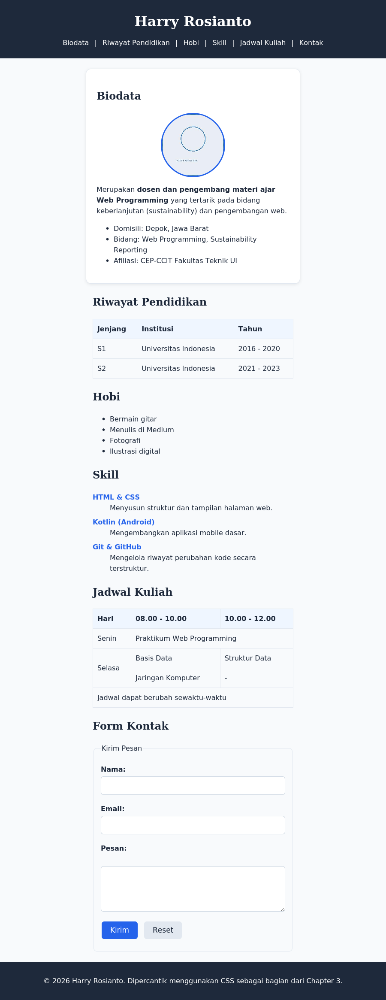

# Chapter 3 — CSS Fundamentals

## Deskripsi

Chapter ini melanjutkan Chapter 2 dengan mempercantik tampilan Website Profil Pribadi menggunakan CSS dasar: warna, background, typography, Box Model, border, ukuran, unit, display, dan overflow — seluruhnya tanpa Flexbox, CSS Grid, Media Query, maupun JavaScript.

## Learning Objectives

Setelah menyelesaikan chapter ini, mahasiswa mampu:

- Menghubungkan file CSS eksternal ke dokumen HTML.
- Menggunakan CSS Selector (basic, grouping, combinator) secara tepat.
- Menerapkan warna, background, dan typography pada halaman web.
- Menjelaskan dan menerapkan Box Model (content, padding, border, margin).
- Mengatur border, ukuran elemen, unit CSS, display, dan overflow.
- Mempercantik halaman Website Profil Pribadi hasil Chapter 2 menggunakan CSS dasar.

## Cara Menjalankan Project

1. Masuk ke folder chapter ini:
   ```bash
   cd chapter-3
   ```
2. Untuk melihat hasil akhir referensi, buka `mini-project/final/index.html` di Visual Studio Code.
3. Untuk berlatih dari awal, buka `mini-project/starter/index.html` beserta `style.css` (berisi TODO), atau folder `praktikum/` untuk latihan bertahap.
4. Klik kanan pada file `.html` yang dipilih → **Open with Live Server**.
5. Halaman akan terbuka otomatis di browser pada `http://127.0.0.1:5500/`.

## Struktur Folder

```
chapter-3/
├── README.md
├── praktikum/
│   ├── praktikum-1-css-eksternal/
│   │   ├── INSTRUKSI.md
│   │   └── starter/
│   │       ├── index.html
│   │       └── style.css
│   ├── praktikum-2-warna-font-background/
│   │   ├── INSTRUKSI.md
│   │   └── starter/
│   │       ├── index.html
│   │       └── style.css
│   ├── praktikum-3-kartu-profil/
│   │   ├── INSTRUKSI.md
│   │   └── starter/
│   │       ├── index.html
│   │       └── style.css
│   └── praktikum-4-mempercantik-profil-mahasiswa/
│       ├── INSTRUKSI.md
│       └── starter/
│           ├── index.html
│           └── style.css
├── challenge/
│   ├── INSTRUKSI.md
│   └── starter/
│       ├── index.html
│       └── style.css
├── mini-project/
│   ├── REQUIREMENTS.md
│   ├── starter/
│   │   ├── index.html          # Struktur sama seperti final Chapter 2
│   │   ├── style.css           # Starter Code — berisi TODO
│   │   └── assets/foto-placeholder.jpg
│   └── final/
│       ├── index.html          # Struktur sama, ditambah class untuk styling
│       ├── style.css           # Final Code — CSS lengkap
│       └── assets/foto-placeholder.jpg
└── assets/
    └── screenshot-hasil-akhir.png
```

## Penjelasan Setiap File

| File / Folder | Penjelasan |
|---|---|
| `praktikum/praktikum-1-css-eksternal/` | Latihan pertama: menghubungkan file `style.css` eksternal ke `index.html`. |
| `praktikum/praktikum-2-warna-font-background/` | Latihan kedua: menerapkan warna, font, dan background pada halaman biodata. |
| `praktikum/praktikum-3-kartu-profil/` | Latihan ketiga: membuat Profile Card menggunakan Box Model, border, dan background. |
| `praktikum/praktikum-4-mempercantik-profil-mahasiswa/` | Latihan keempat: menerapkan seluruh materi CSS pada halaman profil mahasiswa Chapter 2. |
| `challenge/starter/` | Starter untuk challenge mandiri (efek hover, badge, display inline-block). Solusi tidak disediakan. |
| `mini-project/starter/style.css` | Starter Code — file CSS kosong berisi TODO untuk setiap bagian halaman. |
| `mini-project/final/style.css` | Final Code — CSS lengkap mempercantik seluruh bagian Website Profil Pribadi. |
| `assets/screenshot-hasil-akhir.png` | Screenshot asli hasil render `mini-project/final/index.html` dengan CSS diterapkan. |

## Screenshot



> Berbeda dengan Chapter 1 dan 2 yang tampilannya masih polos, screenshot Chapter 3 ini sudah menunjukkan hasil styling CSS: warna, kartu biodata, tabel rapi, dan form yang lebih tertata.

## Assignment

- [ ] **Praktikum 1–4** — Selesaikan seluruh starter code pada folder `praktikum/` sesuai `INSTRUKSI.md` masing-masing.
- [ ] **Challenge** — Lengkapi `challenge/starter/` sesuai `challenge/INSTRUKSI.md`. Solusi tidak disediakan.
- [ ] **Mini Project** — Lengkapi `mini-project/starter/style.css` mengikuti `mini-project/REQUIREMENTS.md`.
  - [ ] TODO: Style header dan navigasi
  - [ ] TODO: Style foto profil (border-radius)
  - [ ] TODO: Card untuk bagian biodata (Box Model + border + shadow)
  - [ ] TODO: Style tabel riwayat pendidikan & jadwal kuliah
  - [ ] TODO: Style form kontak
  - [ ] TODO: Style footer
  - [ ] TODO: Palet warna & font konsisten di seluruh halaman
- [ ] Ambil screenshot hasil akhir, perbarui `assets/screenshot-hasil-akhir.png` jika styling diubah.
- [ ] Ikuti urutan commit pada bagian [Git Commit History](#git-commit-history) di bawah.

---

## Git Commit History

```
1. Menambahkan starter code chapter 3
2. Menambahkan praktikum 1 - Menghubungkan CSS Eksternal
3. Menambahkan praktikum 2 - Warna, Font, dan Background
4. Menambahkan praktikum 3 - Kartu Profil
5. Menambahkan praktikum 4 - Mempercantik Profil Mahasiswa
6. Menambahkan challenge
7. Menambahkan styling mini project (final CSS)
8. Menambahkan dokumentasi README chapter 3
9. Finalisasi Chapter 3
```

## Git Command

```bash
git checkout -b chapter-3
git add .
git commit -m "Menambahkan styling mini project"
git log --oneline
git checkout main
git merge chapter-3
git push
```

Referensi perintah Git secara lebih lengkap tersedia pada [`GIT-GUIDE.md`](../GIT-GUIDE.md) di root repository.

## Best Practice

- Menggunakan External CSS (`style.css`), bukan Inline maupun Internal CSS.
- Memberi nama class berdasarkan fungsi elemen, misalnya `.kartu-biodata`, bukan `.biru` atau `.kiri`.
- Mengelompokkan aturan CSS per komponen (header, navigasi, kartu, tabel, form, footer) disertai komentar penanda.
- Menetapkan palet warna dan jenis font yang konsisten sejak awal, maksimal 3–4 warna dan 2 jenis font.
- Menerapkan `box-sizing: border-box;` secara global agar penghitungan ukuran elemen lebih intuitif.
- Melakukan commit per tahapan pekerjaan, bukan satu commit besar di akhir.
