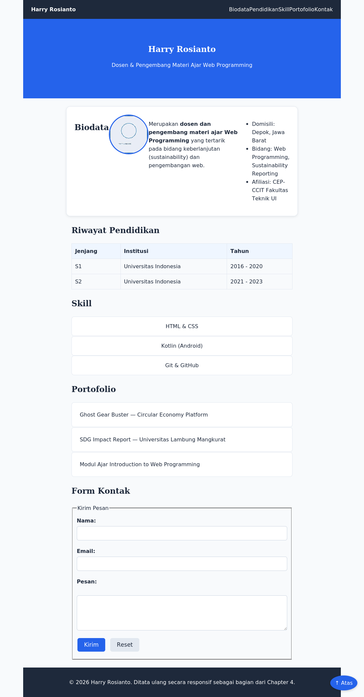

# Chapter 4 — CSS Layout

## Deskripsi

Chapter ini melanjutkan Chapter 3 dengan menata ulang layout Website Profil Pribadi menggunakan Flexbox, CSS Grid, Position, dan Media Query, sehingga tampilan menjadi rapi, terstruktur, dan responsif pada desktop, tablet, maupun smartphone — masih tanpa JavaScript.

## Learning Objectives

Setelah menyelesaikan chapter ini, mahasiswa mampu:

- Membedakan karakteristik `display: block`, `inline`, `inline-block`, `none`, `flex`, dan `grid`.
- Menggunakan properti `position` (`static`, `relative`, `absolute`, `fixed`, `sticky`) secara tepat.
- Menerapkan `z-index` untuk mengatur urutan tumpukan elemen.
- Membangun tata letak menggunakan Flexbox (flex container & flex item).
- Membangun tata letak menggunakan CSS Grid (grid container & grid item).
- Menerapkan Media Query dengan pendekatan Mobile First.
- Mengubah Website Profil Pribadi menjadi tata letak yang responsif menggunakan Flexbox, CSS Grid, Position, dan Media Query.

## Cara Menjalankan Project

1. Masuk ke folder chapter ini:
   ```bash
   cd chapter-4
   ```
2. Untuk melihat hasil akhir referensi, buka `mini-project/final/index.html` di Visual Studio Code.
3. Untuk berlatih dari awal, buka `mini-project/starter/` beserta `style.css` (berisi TODO), atau folder `praktikum/` untuk latihan bertahap.
4. Klik kanan pada file `.html` yang dipilih → **Open with Live Server**.
5. Uji tampilan pada berbagai ukuran layar melalui **Developer Tools → Toggle Device Toolbar** (Desktop, Tablet, Smartphone).

## Struktur Folder

```
chapter-4/
├── README.md
├── praktikum/
│   ├── praktikum-1-flexbox-profil/
│   │   ├── INSTRUKSI.md
│   │   └── starter/ (index.html, style.css)
│   ├── praktikum-2-navbar-flexbox/
│   │   ├── INSTRUKSI.md
│   │   └── starter/
│   ├── praktikum-3-grid-card/
│   │   ├── INSTRUKSI.md
│   │   └── starter/
│   ├── praktikum-4-media-query/
│   │   ├── INSTRUKSI.md
│   │   └── starter/
│   └── praktikum-5-optimasi-responsif/
│       ├── INSTRUKSI.md
│       └── starter/
├── challenge/
│   ├── INSTRUKSI.md
│   └── starter/
├── mini-project/
│   ├── REQUIREMENTS.md
│   ├── starter/
│   │   ├── index.html          # Struktur diperluas: navbar, hero, portofolio
│   │   ├── style.css           # Starter Code — berisi TODO layout
│   │   └── assets/foto-placeholder.jpg
│   └── final/
│       ├── index.html
│       ├── style.css           # Final Code — Flexbox + Grid + Position + Media Query
│       └── assets/foto-placeholder.jpg
└── assets/
    └── screenshot-hasil-akhir.png
```

## Penjelasan Setiap File

| File / Folder | Penjelasan |
|---|---|
| `praktikum/praktikum-1-flexbox-profil/` | Menerapkan Flexbox pada navigasi dan biodata (foto sejajar teks). |
| `praktikum/praktikum-2-navbar-flexbox/` | Membangun navigation bar lengkap (logo di kiri, menu di kanan) dengan Flexbox. |
| `praktikum/praktikum-3-grid-card/` | Menyusun bagian Skill dalam bentuk grid kartu menggunakan CSS Grid. |
| `praktikum/praktikum-4-media-query/` | Menambahkan Media Query agar navbar dan grid menyesuaikan diri pada layar sempit. |
| `praktikum/praktikum-5-optimasi-responsif/` | Menyempurnakan Media Query bertingkat: smartphone → tablet → desktop. |
| `challenge/starter/` | Starter untuk challenge mandiri (hero section, portofolio grid, tombol fixed). Solusi tidak disediakan. |
| `mini-project/starter/style.css` | Starter Code — CSS kosong berisi TODO layout (navbar, hero, grid, media query). |
| `mini-project/final/style.css` | Final Code — layout lengkap: Flexbox, CSS Grid, Position, dan Media Query 3 breakpoint. |
| `assets/screenshot-hasil-akhir.png` | Screenshot asli hasil render `mini-project/final/index.html` pada lebar desktop. |

## Screenshot



> Dibandingkan Chapter 3, tampilan Chapter 4 ini sudah memiliki navigation bar sejajar rapi (Flexbox), grid skill berkolom (CSS Grid), dan struktur yang siap menyesuaikan diri pada layar sempit (Media Query).

## Assignment

- [ ] **Praktikum 1–5** — Selesaikan seluruh starter code pada folder `praktikum/` sesuai `INSTRUKSI.md` masing-masing.
- [ ] **Challenge** — Lengkapi `challenge/starter/` sesuai `challenge/INSTRUKSI.md`. Solusi tidak disediakan.
- [ ] **Mini Project** — Lengkapi `mini-project/starter/style.css` mengikuti `mini-project/REQUIREMENTS.md`.
  - [ ] TODO: Navigation Bar responsif (Flexbox + Media Query)
  - [ ] TODO: Hero Section (Flexbox)
  - [ ] TODO: Profil — foto & biodata sejajar (Flexbox)
  - [ ] TODO: Grid Skill (CSS Grid, kolom menyesuaikan layar)
  - [ ] TODO: Grid Portofolio (CSS Grid)
  - [ ] TODO: Minimal satu penerapan `position` selain `static`
  - [ ] TODO: Media Query minimal 2 breakpoint (tablet, desktop)
  - [ ] TODO: Uji tampilan pada Desktop, Tablet, dan Smartphone
- [ ] Ambil screenshot hasil akhir, perbarui `assets/screenshot-hasil-akhir.png` jika layout diubah.
- [ ] Ikuti urutan commit pada bagian [Git Commit History](#git-commit-history) di bawah.

---

## Git Commit History

```
1. Menambahkan starter code chapter 4
2. Menambahkan praktikum 1 - Flexbox pada Profil
3. Menambahkan praktikum 2 - Navigation Bar Flexbox
4. Menambahkan praktikum 3 - Grid Card
5. Menambahkan praktikum 4 - Media Query
6. Menambahkan praktikum 5 - Optimasi Responsif
7. Menambahkan challenge
8. Menambahkan layout responsif mini project (final CSS)
9. Menambahkan dokumentasi README dan screenshot chapter 4
10. Finalisasi Chapter 4
```

## Git Command

```bash
git checkout -b chapter-4
git add .
git commit -m "Menambahkan layout responsif mini project"
git log --oneline
git checkout main
git merge chapter-4
git push
```

Referensi perintah Git secara lebih lengkap tersedia pada [`GIT-GUIDE.md`](../GIT-GUIDE.md) di root repository.

## Best Practice

- Menggunakan Flexbox untuk susunan satu dimensi (navigasi, baris tombol) dan CSS Grid untuk susunan dua dimensi (galeri, kartu).
- Menerapkan pendekatan Mobile First: menulis gaya dasar untuk layar sempit, baru menambahkan `@media (min-width: ...)` untuk layar lebih besar.
- Menghindari `width` tetap pada kontainer utama; menggunakan `max-width` bersama `width: 100%`.
- Membatasi penggunaan `position: absolute` untuk penempatan elemen kecil yang presisi, bukan layout struktural.
- Melakukan commit per tahapan pekerjaan, bukan satu commit besar di akhir.
