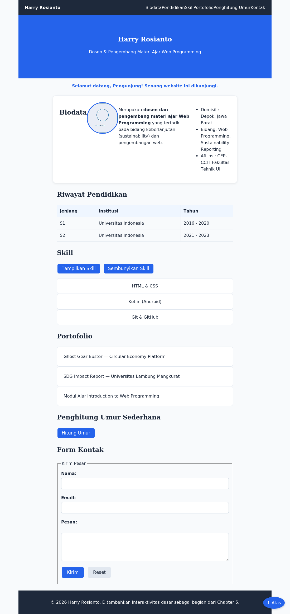

# Chapter 5 — Introduction to JavaScript

## Deskripsi

Chapter ini melanjutkan Chapter 4 dengan menambahkan interaktivitas dasar pada Website Profil Pribadi menggunakan JavaScript: variabel, tipe data, operator, percabangan, perulangan, fungsi, array, dan object — tanpa manipulasi DOM lanjutan maupun event listener modern (dibahas di Chapter 6).

## Learning Objectives

Setelah menyelesaikan chapter ini, mahasiswa mampu:

- Menghubungkan JavaScript ke HTML melalui External JavaScript (`script.js`).
- Menggunakan `console.log()` dan Developer Tools untuk debugging dasar.
- Mendeklarasikan variabel dengan `let` dan `const` secara tepat.
- Menggunakan operator aritmatika, perbandingan (termasuk `===`), dan logika.
- Mengambil input melalui `prompt()` dan mengonversi tipe data.
- Menulis percabangan (`if`/`else if`/`switch`) dan perulangan (`for`/`while`/`do while`).
- Membuat dan memanggil fungsi dengan parameter, argumen, dan return value.
- Mengolah data menggunakan Array dan Object.
- Menampilkan teks dinamis pada halaman menggunakan `document.getElementById()`.

## Cara Menjalankan Project

1. Masuk ke folder chapter ini:
   ```bash
   cd chapter-5
   ```
2. Untuk melihat hasil akhir referensi, buka `mini-project/final/index.html` di Visual Studio Code.
3. Untuk berlatih dari awal, buka `mini-project/starter/` beserta `script.js` (berisi TODO), atau folder `praktikum/` untuk latihan bertahap.
4. Klik kanan pada file `.html` yang dipilih → **Open with Live Server**.
5. Buka Developer Tools (F12) → tab **Console** untuk melihat output `console.log()`.

## Struktur Folder

```
chapter-5/
├── README.md
├── praktikum/
│   ├── praktikum-1-script-js/
│   ├── praktikum-2-biodata-variabel/
│   ├── praktikum-3-kalkulator/
│   ├── praktikum-4-nilai-huruf/
│   ├── praktikum-5-array-matkul/
│   ├── praktikum-6-object-mahasiswa/
│   └── praktikum-7-ucapan-selamat-datang/
├── challenge/
│   ├── INSTRUKSI.md
│   └── starter/
├── mini-project/
│   ├── REQUIREMENTS.md
│   ├── starter/
│   │   ├── index.html          # Struktur sama seperti final Chapter 4
│   │   ├── style.css
│   │   ├── script.js           # Starter Code — berisi TODO
│   │   └── assets/foto-placeholder.jpg
│   └── final/
│       ├── index.html
│       ├── style.css
│       ├── script.js           # Final Code — fitur JavaScript lengkap
│       └── assets/foto-placeholder.jpg
└── assets/
    └── screenshot-hasil-akhir.png
```

## Penjelasan Setiap File

| File / Folder | Penjelasan |
|---|---|
| `praktikum/praktikum-1-script-js/` | Menghubungkan `script.js` eksternal, menampilkan pesan pertama di Console. |
| `praktikum/praktikum-2-biodata-variabel/` | Variabel `let`/`const` dan tipe data dasar. |
| `praktikum/praktikum-3-kalkulator/` | `prompt()`, konversi tipe data, dan operator aritmatika. |
| `praktikum/praktikum-4-nilai-huruf/` | Percabangan `if`/`else if` pada studi kasus penilaian mahasiswa. |
| `praktikum/praktikum-5-array-matkul/` | Array dan method (`push`, `length`) beserta perulangan `for`. |
| `praktikum/praktikum-6-object-mahasiswa/` | Object dan property (membuat, mengakses, mengubah). |
| `praktikum/praktikum-7-ucapan-selamat-datang/` | Fungsi + `document.getElementById()` pada Website Profil Pribadi. |
| `challenge/starter/` | Starter untuk challenge mandiri (rata-rata nilai, fungsi kelulusan, object produk). Solusi tidak disediakan. |
| `mini-project/starter/script.js` | Starter Code — JavaScript kosong berisi TODO (prompt nama, tahun footer, tombol skill, penghitung umur). |
| `mini-project/final/script.js` | Final Code — seluruh fitur JavaScript dasar diterapkan. |
| `assets/screenshot-hasil-akhir.png` | Screenshot asli hasil render `mini-project/final/index.html`. |

## Screenshot



> Dibandingkan Chapter 4, halaman ini kini menampilkan ucapan selamat datang dan nama pengguna secara dinamis di bagian atas, serta tahun berjalan otomatis di footer — seluruhnya dihasilkan oleh `script.js`, bukan ditulis manual di HTML.

## Assignment

- [ ] **Praktikum 1–7** — Selesaikan seluruh starter code pada folder `praktikum/` sesuai `INSTRUKSI.md` masing-masing.
- [ ] **Challenge** — Lengkapi `challenge/starter/` sesuai `challenge/INSTRUKSI.md`. Solusi tidak disediakan.
- [ ] **Mini Project** — Lengkapi `mini-project/starter/script.js` mengikuti `mini-project/REQUIREMENTS.md`.
  - [ ] TODO: Ucapan selamat datang menggunakan `prompt()`
  - [ ] TODO: Tampilkan nama pengguna pada halaman
  - [ ] TODO: Tahun otomatis pada footer (`new Date().getFullYear()`)
  - [ ] TODO: Tombol "Tampilkan Skill"
  - [ ] TODO: Tombol "Sembunyikan Skill"
  - [ ] TODO: Program penghitung umur sederhana
- [ ] Ambil screenshot hasil akhir, perbarui `assets/screenshot-hasil-akhir.png` jika fitur ditambah.
- [ ] Ikuti urutan commit pada bagian [Git Commit History](#git-commit-history) di bawah.

---

## Git Commit History

```
1. Menambahkan starter code chapter 5
2. Menambahkan praktikum 1 - Membuat script.js
3. Menambahkan praktikum 2 - Biodata Menggunakan Variabel
4. Menambahkan praktikum 3 - Kalkulator Sederhana
5. Menambahkan praktikum 4 - Penentuan Nilai Huruf
6. Menambahkan praktikum 5 - Array Mata Kuliah
7. Menambahkan praktikum 6 - Object Mahasiswa
8. Menambahkan praktikum 7 - Ucapan Selamat Datang
9. Menambahkan challenge
10. Menambahkan fitur interaktif mini project (final script.js)
11. Menambahkan dokumentasi README dan screenshot chapter 5
12. Finalisasi Chapter 5
```

## Git Command

```bash
git checkout -b chapter-5
git add .
git commit -m "Menambahkan fitur interaktif mini project"
git log --oneline
git checkout main
git merge chapter-5
git push
```

Referensi perintah Git secara lebih lengkap tersedia pada [`GIT-GUIDE.md`](../GIT-GUIDE.md) di root repository.

## Best Practice

- Menggunakan `const` sebagai pilihan pertama, `let` hanya ketika nilai perlu berubah.
- Menggunakan External JavaScript (`script.js`), diletakkan sesaat sebelum `</body>`.
- Menggunakan `===`/`!==` sebagai standar, menghindari `==`/`!=`.
- Selalu mengonversi hasil `prompt()` (`parseInt()`/`parseFloat()`/`Number()`) sebelum perhitungan.
- Menamai variabel dan fungsi secara deskriptif dengan Camel Case.
- Melakukan commit per tahapan pekerjaan, bukan satu commit besar di akhir.
