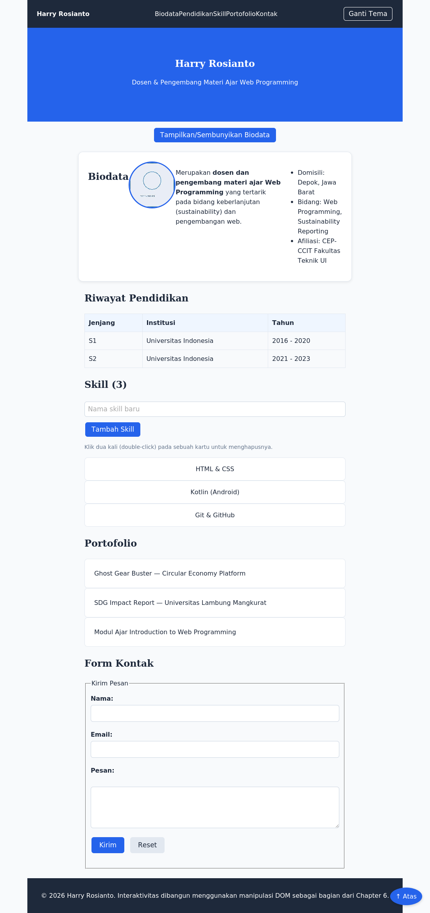

# Chapter 6 — JavaScript and the DOM

## Deskripsi

Chapter ini melanjutkan Chapter 5 dengan mengganti pendekatan interaktivitas dasar (`prompt()`/Inline JavaScript) menjadi manipulasi DOM yang lebih baik dan modern: memilih elemen, mengubah konten/atribut/style, menangani event dengan `addEventListener()`, membuat & menghapus elemen, serta validasi form — seluruhnya pada Website Profil Pribadi.

## Learning Objectives

Setelah menyelesaikan chapter ini, mahasiswa mampu:

- Menjelaskan pengertian DOM dan hubungannya dengan HTML.
- Memilih elemen menggunakan `querySelector()`/`querySelectorAll()` dan method sejenis.
- Mengubah konten (`textContent`/`innerHTML`), atribut, dan style/class elemen.
- Menangani event menggunakan `addEventListener()`.
- Membuat elemen baru (`createElement()`) dan menghapus elemen (`remove()`).
- Melakukan traversing DOM antar elemen yang berkaitan.
- Memvalidasi form sederhana menggunakan `event.preventDefault()`.

## Cara Menjalankan Project

1. Masuk ke folder chapter ini:
   ```bash
   cd chapter-6
   ```
2. Untuk melihat hasil akhir referensi, buka `mini-project/final/index.html` di Visual Studio Code.
3. Untuk berlatih dari awal, buka `mini-project/starter/` beserta `script.js` (berisi TODO), atau folder `praktikum/` untuk latihan bertahap.
4. Klik kanan pada file `.html` yang dipilih → **Open with Live Server**.
5. Buka Developer Tools (F12) → tab **Console** untuk memeriksa output maupun error.

## Struktur Folder

```
chapter-6/
├── README.md
├── praktikum/
│   ├── praktikum-1-pilih-elemen/
│   ├── praktikum-2-warna-ukuran-teks/
│   ├── praktikum-3-ubah-tema/
│   ├── praktikum-4-tampil-sembunyi-biodata/
│   ├── praktikum-5-tambah-skill/
│   ├── praktikum-6-hapus-skill/
│   └── praktikum-7-validasi-form/
├── challenge/
│   ├── INSTRUKSI.md
│   └── starter/
├── mini-project/
│   ├── REQUIREMENTS.md
│   ├── starter/
│   │   ├── index.html          # Struktur sama seperti final Chapter 5
│   │   ├── style.css
│   │   ├── script.js           # Starter Code — berisi TODO
│   │   └── assets/foto-placeholder.jpg
│   └── final/
│       ├── index.html
│       ├── style.css
│       ├── script.js           # Final Code — manipulasi DOM lengkap
│       └── assets/foto-placeholder.jpg
└── assets/
    └── screenshot-hasil-akhir.png
```

## Penjelasan Setiap File

| File / Folder | Penjelasan |
|---|---|
| `praktikum/praktikum-1-pilih-elemen/` | `querySelector()`/`querySelectorAll()`, mengubah teks judul. |
| `praktikum/praktikum-2-warna-ukuran-teks/` | `element.style` untuk mengubah warna dan ukuran font. |
| `praktikum/praktikum-3-ubah-tema/` | `addEventListener()` + `classList.toggle()` untuk tombol ganti tema. |
| `praktikum/praktikum-4-tampil-sembunyi-biodata/` | `classList.toggle()` pada elemen konten (biodata). |
| `praktikum/praktikum-5-tambah-skill/` | `createElement()` + `appendChild()` untuk menambah kartu skill. |
| `praktikum/praktikum-6-hapus-skill/` | `remove()` dipicu event `dblclick` pada kartu skill. |
| `praktikum/praktikum-7-validasi-form/` | `event.preventDefault()` + validasi input kosong pada form kontak. |
| `challenge/starter/` | Starter untuk challenge mandiri (counter skill, confirm(), validasi email, form organisasi). Solusi tidak disediakan. |
| `mini-project/starter/script.js` | Starter Code — JavaScript kosong berisi TODO manipulasi DOM. |
| `mini-project/final/script.js` | Final Code — seluruh fitur DOM diterapkan (ganti tema, tambah/hapus skill, counter, validasi form). |
| `assets/screenshot-hasil-akhir.png` | Screenshot asli hasil render `mini-project/final/index.html`. |

## Screenshot



> Dibandingkan Chapter 5, halaman ini kini menggunakan tombol Ganti Tema, tombol Tampilkan/Sembunyikan Biodata, form tambah Skill dengan counter otomatis, dan validasi form kontak — seluruhnya tanpa `prompt()`/Inline JavaScript, murni melalui `querySelector()` dan `addEventListener()`.

## Assignment

- [ ] **Praktikum 1–7** — Selesaikan seluruh starter code pada folder `praktikum/` sesuai `INSTRUKSI.md` masing-masing.
- [ ] **Challenge** — Lengkapi `challenge/starter/` sesuai `challenge/INSTRUKSI.md`. Solusi tidak disediakan.
- [ ] **Mini Project** — Lengkapi `mini-project/starter/script.js` mengikuti `mini-project/REQUIREMENTS.md`.
  - [ ] TODO: Tombol Ganti Tema (Light/Dark)
  - [ ] TODO: Tombol Tampilkan/Sembunyikan Biodata
  - [ ] TODO: Menambah Skill baru melalui input
  - [ ] TODO: Menghapus Skill
  - [ ] TODO: Counter jumlah skill (otomatis)
  - [ ] TODO: Validasi form kontak sederhana
  - [ ] TODO: Pesan sukses setelah form dikirim
- [ ] Ambil screenshot hasil akhir, perbarui `assets/screenshot-hasil-akhir.png` jika fitur ditambah.
- [ ] Ikuti urutan commit pada bagian [Git Commit History](#git-commit-history) di bawah.

---

## Git Commit History

```
1. Menambahkan starter code chapter 6
2. Menambahkan praktikum 1 - Memilih Elemen dan Mengubah Teks
3. Menambahkan praktikum 2 - Warna dan Ukuran Teks
4. Menambahkan praktikum 3 - Tombol Ubah Tema
5. Menambahkan praktikum 4 - Tampilkan Sembunyikan Biodata
6. Menambahkan praktikum 5 - Tambah Skill Dinamis
7. Menambahkan praktikum 6 - Hapus Skill
8. Menambahkan praktikum 7 - Validasi Form
9. Menambahkan challenge
10. Menambahkan manipulasi DOM lengkap mini project (final script.js)
11. Menambahkan dokumentasi README dan screenshot chapter 6
12. Finalisasi Chapter 6
```

## Git Command

```bash
git checkout -b chapter-6
git add .
git commit -m "Menambahkan manipulasi DOM lengkap mini project"
git log --oneline
git checkout main
git merge chapter-6
git push
```

Referensi perintah Git secara lebih lengkap tersedia pada [`GIT-GUIDE.md`](../GIT-GUIDE.md) di root repository.

## Best Practice

- Menyimpan referensi elemen ke variabel, memanggil `querySelector()` sekali lalu menyimpan hasilnya.
- Menggunakan `querySelector()`/`querySelectorAll()` secara konsisten sebagai pendekatan pemilihan elemen utama.
- Menggunakan `classList` untuk perubahan tampilan, dibandingkan `element.style` satu per satu.
- Menggunakan `addEventListener()` sebagai standar penanganan event, menggantikan Inline JavaScript (`onclick`) Chapter 5.
- Menamai variabel DOM secara jelas, misalnya `tombolTema`, `gridSkill`, `formKontak`.
- Melakukan commit per tahapan pekerjaan, bukan satu commit besar di akhir.
