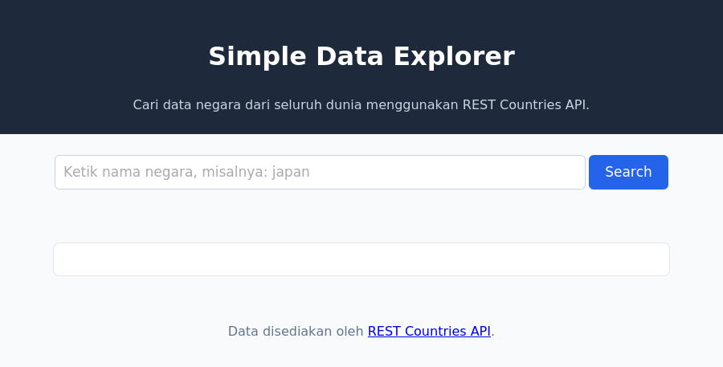

# Chapter 7 — JavaScript Advanced

## Deskripsi

Chapter ini membahas JavaScript modern (ES6+) dan komunikasi dengan API eksternal menggunakan Fetch API. Berbeda dari chapter sebelumnya, chapter ini memiliki **dua deliverable terpisah**: sebuah project baru bernama **Simple Data Explorer**, dan penambahan satu fitur berbasis API pada **Website Profil Pribadi** yang sudah dibangun sejak Chapter 2.

## Learning Objectives

Setelah menyelesaikan chapter ini, mahasiswa mampu:

- Menulis JavaScript modern: `let`/`const`, Arrow Function, Template Literal, Destructuring, Spread/Rest Operator.
- Mengolah Array of Objects menggunakan `forEach()`, `map()`, `filter()`, `find()`, `findIndex()`, `some()`, `every()`.
- Menjelaskan format JSON dan menggunakan `JSON.stringify()`/`JSON.parse()`.
- Menjelaskan konsep API, Client-Server, Request-Response, dan Endpoint.
- Menulis kode asynchronous menggunakan Promise dan `async`/`await`.
- Mengambil data dari API menggunakan Fetch API dan menampilkannya ke halaman via DOM.
- Melakukan error handling terhadap kegagalan jaringan maupun kegagalan API.

## Cara Menjalankan Project

1. Masuk ke folder chapter ini:
   ```bash
   cd chapter-7
   ```
2. Untuk **Simple Data Explorer**, buka `simple-data-explorer/final/index.html`.
3. Untuk **pengembangan Website Profil**, buka `pengembangan-profil/final/index.html`.
4. Untuk berlatih dari awal, gunakan folder `starter/` masing-masing, atau `praktikum/` untuk latihan bertahap.
5. Klik kanan pada file `.html` yang dipilih → **Open with Live Server** (Fetch API tidak berfungsi jika file dibuka langsung dari File Explorer).
6. Buka Developer Tools (F12) → tab **Console** untuk memeriksa output maupun error.

## Struktur Folder

```
chapter-7/
├── README.md
├── praktikum/
│   ├── praktikum-1-modernisasi-js/
│   ├── praktikum-2-array-methods/
│   ├── praktikum-3-json/
│   ├── praktikum-4-fetch-api/
│   ├── praktikum-5-tampilkan-dom/
│   └── praktikum-6-loading-error-handling/
├── challenge/
│   └── starter/
├── simple-data-explorer/       # Mini Project — project baru, berdiri sendiri
│   ├── REQUIREMENTS.md
│   ├── starter/
│   │   ├── index.html
│   │   ├── style.css
│   │   └── script.js           # berisi TODO
│   └── final/
│       ├── index.html
│       ├── style.css
│       └── script.js           # lengkap, memakai REST Countries API
├── pengembangan-profil/        # Lanjutan Website Profil Pribadi Chapter 2-6
│   ├── REQUIREMENTS.md
│   ├── starter/
│   │   ├── index.html          # struktur sama seperti final Chapter 6
│   │   ├── style.css
│   │   ├── script.js           # berisi TODO fitur portofolio dari JSON
│   │   ├── portofolio.json
│   │   └── assets/foto-placeholder.jpg
│   └── final/
│       ├── index.html
│       ├── style.css
│       ├── script.js
│       ├── portofolio.json
│       └── assets/foto-placeholder.jpg
└── assets/
    └── screenshot-hasil-akhir.png
```

## Penjelasan Setiap File

| File / Folder | Penjelasan |
|---|---|
| `praktikum/praktikum-1-modernisasi-js/` | Refactor `var`/`function` lama menjadi `const`/Arrow Function/Template Literal. |
| `praktikum/praktikum-2-array-methods/` | `forEach()`, `map()`, `filter()`, `find()` pada Array of Objects mahasiswa. |
| `praktikum/praktikum-3-json/` | `JSON.stringify()` dan `JSON.parse()`. |
| `praktikum/praktikum-4-fetch-api/` | `fetch()` + `async`/`await` mengambil data dari REST Countries API. |
| `praktikum/praktikum-5-tampilkan-dom/` | Menampilkan data hasil fetch ke halaman HTML. |
| `praktikum/praktikum-6-loading-error-handling/` | Status loading + `response.ok` + `try`/`catch`. |
| `challenge/starter/` | Starter untuk challenge mandiri (some/every, findIndex, map+join multi-data, destructuring). Solusi tidak disediakan. |
| `simple-data-explorer/` | **Mini Project** — pencarian negara via REST Countries API, lengkap loading/detail/error state. |
| `pengembangan-profil/` | Menambahkan bagian Portofolio yang datanya diambil dari `portofolio.json` menggunakan `fetch()`, bukan lagi statis di HTML. |
| `assets/screenshot-hasil-akhir.png` | Screenshot asli hasil render Simple Data Explorer. |

## Screenshot



> Simple Data Explorer memungkinkan pencarian negara secara real-time dari REST Countries API, lengkap dengan status loading, daftar hasil, detail data, serta pesan ketika data tidak ditemukan atau API gagal diakses.

## Assignment

- [ ] **Praktikum 1–6** — Selesaikan seluruh starter code pada folder `praktikum/` sesuai `INSTRUKSI.md` masing-masing.
- [ ] **Challenge** — Lengkapi `challenge/starter/` sesuai `challenge/INSTRUKSI.md`. Solusi tidak disediakan.
- [ ] **Simple Data Explorer** — Lengkapi `simple-data-explorer/starter/script.js` mengikuti `simple-data-explorer/REQUIREMENTS.md`.
  - [ ] TODO: Input pencarian + tombol Search
  - [ ] TODO: Loading indicator
  - [ ] TODO: Fetch data dari REST Countries API
  - [ ] TODO: Tampilkan daftar hasil ke DOM
  - [ ] TODO: Tampilkan detail data saat item diklik
  - [ ] TODO: Pesan saat data tidak ditemukan
  - [ ] TODO: Error message saat API gagal
- [ ] **Pengembangan Profil** — Lengkapi `pengembangan-profil/starter/script.js` mengikuti `pengembangan-profil/REQUIREMENTS.md`.
  - [ ] TODO: Fetch `portofolio.json`, tampilkan ke `#grid-portofolio` menggunakan `map().join()`
  - [ ] TODO: Status loading dan error handling
- [ ] Ambil screenshot hasil akhir, perbarui `assets/screenshot-hasil-akhir.png` jika tampilan diubah.
- [ ] Ikuti urutan commit pada bagian [Git Commit History](#git-commit-history) di bawah.

---

## Git Commit History

```
1. Menambahkan starter code chapter 7
2. Menambahkan praktikum 1 - Modernisasi JavaScript
3. Menambahkan praktikum 2 - Array Methods
4. Menambahkan praktikum 3 - JSON
5. Menambahkan praktikum 4 - Fetch API
6. Menambahkan praktikum 5 - Menampilkan Data ke DOM
7. Menambahkan praktikum 6 - Loading State dan Error Handling
8. Menambahkan challenge
9. Menambahkan Simple Data Explorer (final)
10. Menambahkan fitur portofolio berbasis API pada Website Profil (final)
11. Menambahkan dokumentasi README dan screenshot chapter 7
12. Finalisasi Chapter 7
```

## Git Command

```bash
git checkout -b chapter-7
git add .
git commit -m "Menambahkan Simple Data Explorer dan fitur API pada Website Profil"
git log --oneline
git checkout main
git merge chapter-7
git push
```

Referensi perintah Git secara lebih lengkap tersedia pada [`GIT-GUIDE.md`](../GIT-GUIDE.md) di root repository.

## Best Practice

- Gunakan `const` jika variabel tidak perlu diubah, `let` jika memang perlu diubah.
- Pisahkan fungsi pengambilan data (fetch) dan fungsi rendering (menampilkan ke DOM).
- Gunakan `async`/`await` untuk kode asynchronous yang mudah dibaca.
- Selalu lakukan error handling dan periksa `response.ok`, jangan hanya mengandalkan `try`/`catch`.
- Jangan menampilkan data API tanpa validasi dasar (periksa keberadaan property terlebih dahulu).
- Melakukan commit per tahapan pekerjaan, bukan satu commit besar di akhir.
